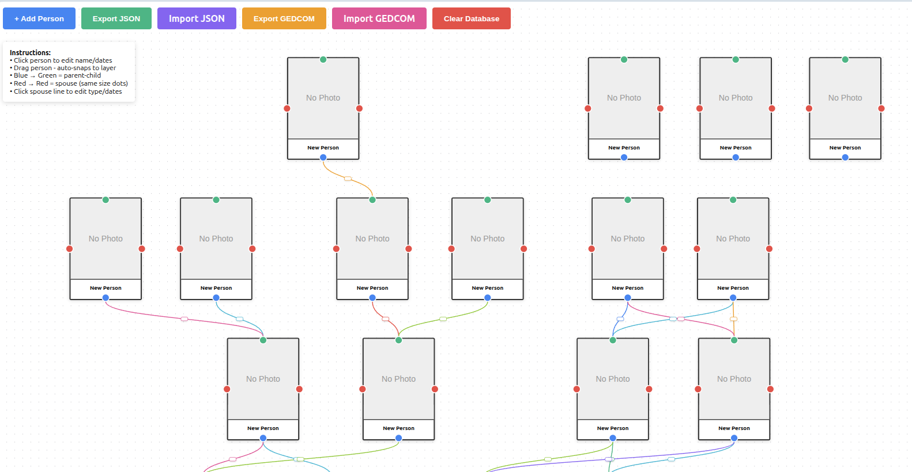

# The Family Tree App

A cross-platform family tree application built with Tauri, React, and React Flow.

Work in progress.

## Todo
- [ ] Better looking connections
- [ ] Improve tranlation
- [ ] Change rectangle <-> circle
- [ ] Show/Hide sections
- [ ] Add configuration to show what's displayed.

## Tech Stack

- **Frontend**: React + React Flow
- **Desktop**: Tauri (Rust)
- **Web Database**: IndexedDB
- **Desktop Database**: SQLite
- **Build Tool**: Vite

## License
This work is released under the MIT License.